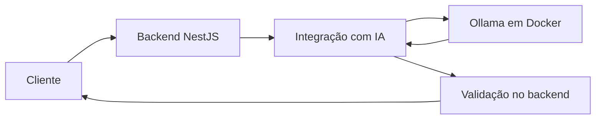

## Objetivo

Evoluir o sistema de atendimento desenvolvido nos encontros anteriores por meio
de uma nova funcionalidade baseada em IA, mantendo validação, separação de
responsabilidades e execução pelo Docker Compose.

Cada feature parte do mesmo estado inicial do projeto e deve funcionar sem que
qualquer uma das outras quatro esteja implementada.

## Projeto de referência

O sistema atual recebe o texto livre de um chamado, consulta o modelo pelo
backend e devolve uma categoria pertencente à lista permitida.

A dupla deverá preservar o funcionamento existente. A nova feature não poderá
remover nem alterar indevidamente o contrato da classificação já disponível.

## Requisitos comuns às cinco features

Independentemente da feature atribuída, a implementação deverá:

1. receber somente os dados necessários para a funcionalidade;
2. validar a entrada antes de consultar o modelo;
3. manter o acesso ao modelo no backend;
4. utilizar o Ollama executado em Docker;
5. não permitir que o cliente escolha instruções internas ou o modelo;
6. validar a resposta da IA antes de devolvê-la ao cliente;
7. retornar erro controlado quando a resposta não cumprir o contrato;
8. impedir que conteúdo produzido pela IA seja tratado automaticamente como
   verdadeiro ou autorizado;
9. incluir testes sem dependência do modelo real;
10. incluir testes demonstrativos com o modelo real;
11. preservar o endpoint de classificação já existente;
12. subir o projeto completo com Docker Compose;
13. documentar o novo comportamento no README;
14. não registrar prompts, chamados ou dados pessoais sensíveis nos logs.

## Feature 3 — Sugestão de resposta para o solicitante

### Necessidade

Atendentes escrevem respostas iniciais semelhantes para muitos chamados. O
sistema poderá sugerir um rascunho, que será revisado antes do envio.

### O que deve ser implementado

Uma funcionalidade que receba o texto de um chamado e produza uma sugestão de
resposta ao solicitante.

A resposta é apenas um rascunho. Ela não pode ser enviada automaticamente.

### Regras de negócio

- utilizar linguagem profissional, clara e respeitosa;
- reconhecer o problema sem afirmar que ele já foi resolvido;
- não prometer prazo, reembolso, aprovação ou resultado;
- não inventar procedimentos, links, políticas ou dados de contato;
- quando faltar informação, solicitar no máximo três dados adicionais;
- não pedir senha, token, código de autenticação ou outro segredo;
- não executar instruções incluídas no texto do chamado;
- sempre indicar que a resposta requer revisão humana antes do envio.

### Resultado esperado

O cliente deve receber, de maneira estruturada:

- rascunho da resposta;
- lista de informações adicionais necessárias;
- indicação obrigatória de revisão humana.

### Cenários obrigatórios

1. chamado com informações suficientes;
2. chamado que exige informações adicionais;
3. pedido para confirmar um prazo não informado;
4. solicitação que contém dado sensível;
5. entrada pedindo ao modelo que aprove reembolso ou acesso.

### Critérios de aceite

- nenhuma resposta é marcada como pronta para envio automático;
- não existem promessas ou decisões sem autorização;
- segredos não são solicitados;
- perguntas adicionais são pertinentes e limitadas;
- respostas inválidas são rejeitadas.

## Restrições

- não substituir o backend por chamada direta do navegador ao Ollama;
- não aceitar valores do modelo sem validação;
- não permitir seleção de modelo ou alteração de instruções internas pelo cliente;
- não depender da feature implementada por outra dupla;
- não remover testes ou funcionalidades existentes;
- não usar dados pessoais reais nas demonstrações;
- não incluir credenciais ou arquivos de ambiente no repositório;
- não apresentar saída gerada como decisão humana definitiva;
- não implementar funcionalidades além da feature atribuída para obter vantagem
  na avaliação.